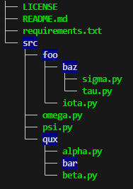
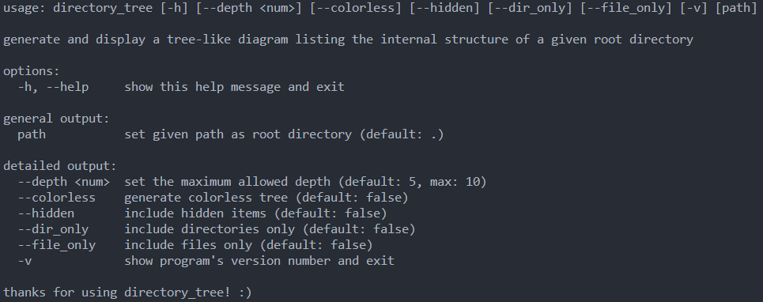

# Directory Tree Project

`directory_tree` is a command-line tool to generate and display a tree-like diagram listing the internal structure of a given root directory.

## Sample Tree



## Installation

```
git clone https://github.com/dogukan-aysan/DirectoryTree/
cd DirectoryTree
$ pip install -r requirements.txt
```

## Usage

```sh
$ cd DirectoryTree
$ py directory_tree /path/to/tree/root
```

**Note:** The `-h` or `--help` option provides help on using directory_tree.


## About the Author

**Dogukan Aysan** <br/>
Email - dogukanaysan01@gmail.com <br/>
Linkedin - https://www.linkedin.com/in/dogukan-aysan
